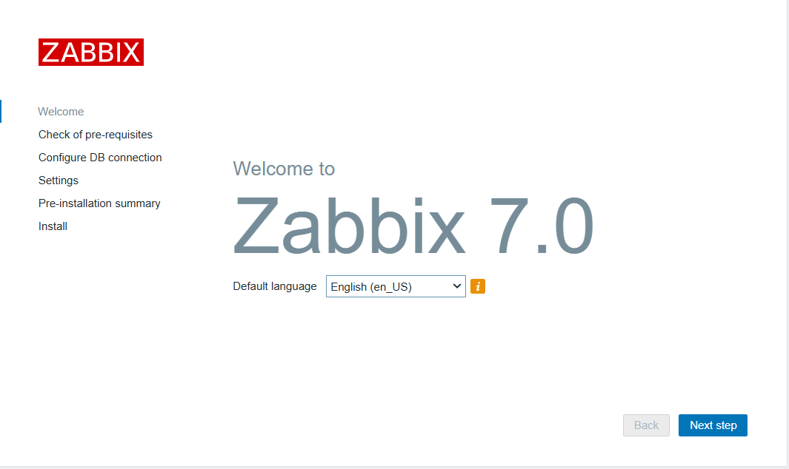
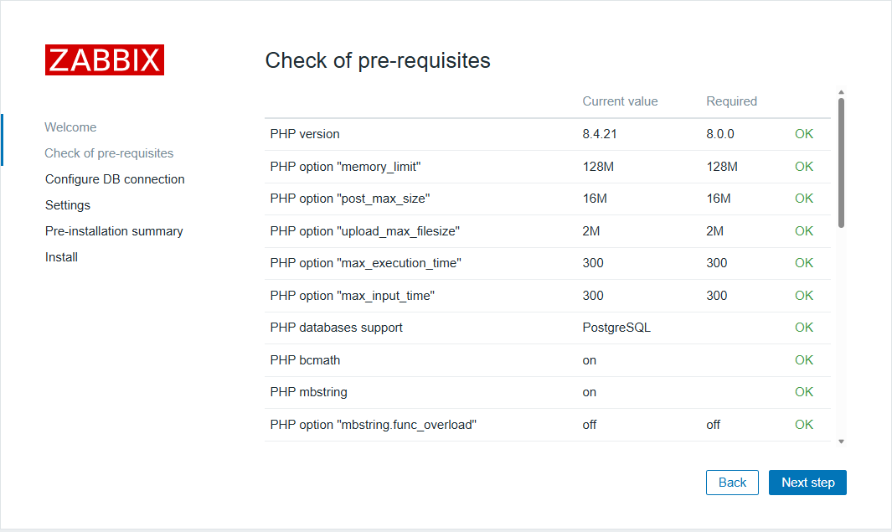
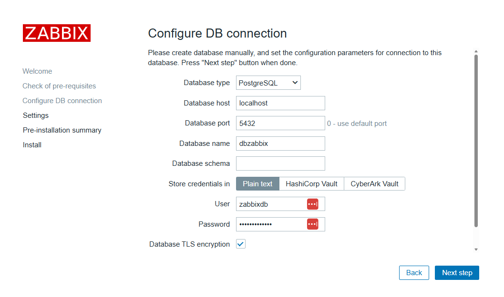
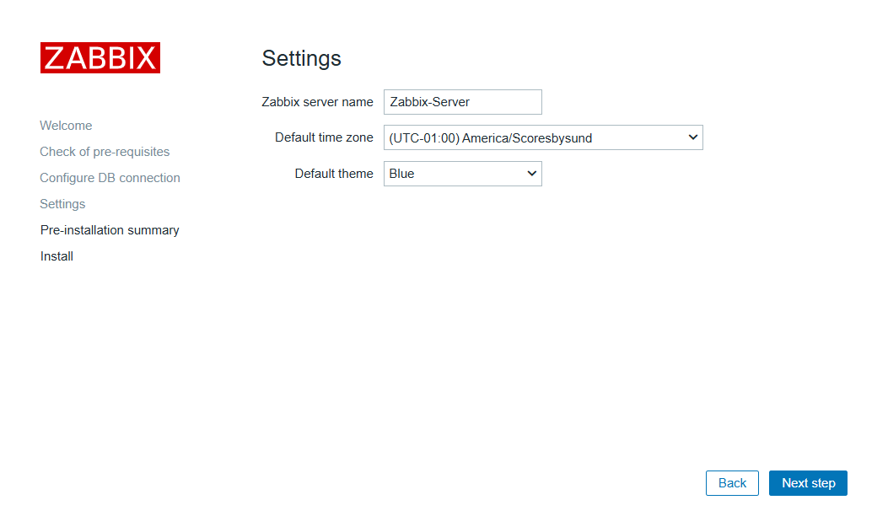
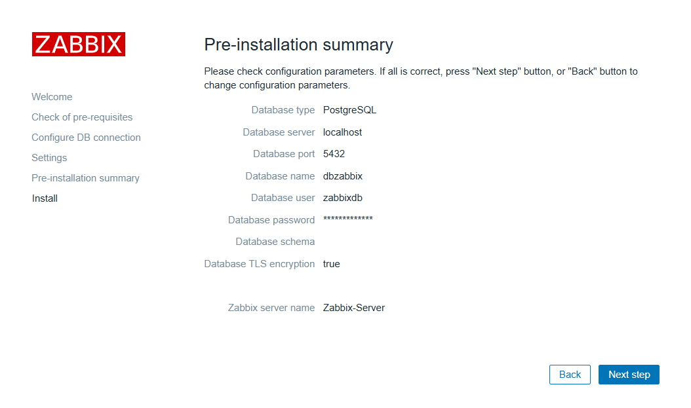
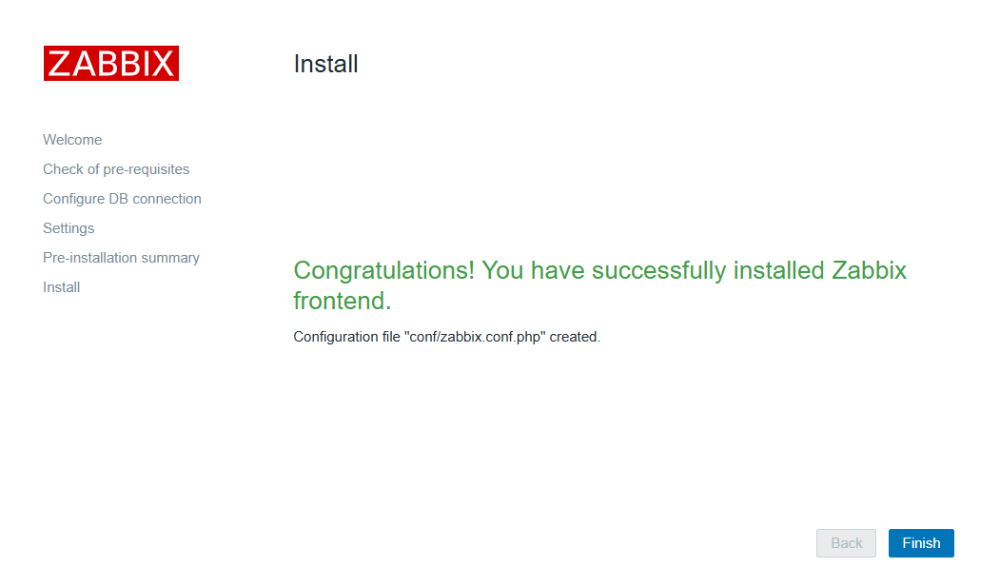
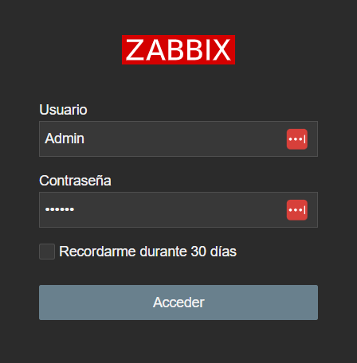
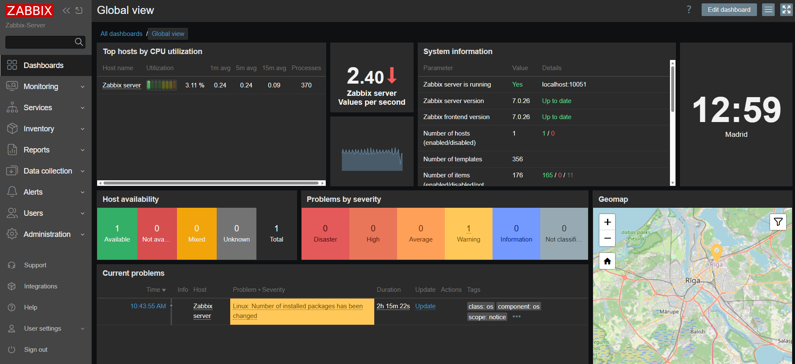

# Zabbix7.X on Debian13

In this guide, we will teach the correct installation of Zabbix 7 step by step, covering both the LTS version and the latest 7.4 release on Debian 13, using a PostgreSQL database with the TimeScaleDB plugin and the Nginx web server.

---
<p align="center">
  
</p>
---

## :book: Index

* 👮 [Terms of use](./LICENSE)
* ♻️ [Features](#recycle-features)
* ✅ [Requirements](#white_check_mark-requirements)
* ⚙️ [Install basic software](#gear-install-basic-software)
* 🧰 [Configure PostgreSQL](#toolbox-configure-postgresql)
* 🕛 [Configure TimeScaleDB](#clock12-configure-timescaledb)
* 🛠️ [Configure Zabbix server](#hammer_and_wrench-configure-zabbix-server)
* 🖥️ [Configure Nginx for Zabbix frontend](#desktop_computer-configure-nginx-for-zabbix-frontend)
* 🔗 [Final web server configuration](#link-final-web-server-configuration)

## :recycle: Features

- Compatible with any Debian-based distribution
- The most powerful build you can make of Zabbix
- PostgreSQL is among the top databases
- TimeScaleDB will speed up PostgreSQL and compress the database
- Nginx is among the top web servers
- Database installation on a separate disk
- Guide 100% tested in production environments

## :white_check_mark: Requirements

- Basic knowledge of Linux
- Basic knowledge of databases
- One 20GB disk and another 10GB disk (if possible)
- From 4GB to 16GB of RAM, depending on the environment
- Between 2 and 4 CPU cores, depending on the environment
- Internet connection to install software

## :gear: Install basic software 

### Install system packages:
First, we are going to install the software and the necessary tools to minimize the use of the root user.
As root user:
```bash
apt update
apt install rsync sudo gnupg curl locales net-tools
```
Add our system user to sudo:
```bash
usermod -aG sudo YOUR_USER
```

👁️ Now that our normal user has the necessary permissions to carry everything out, we will log out from the root account. If we had a session started with our normal user, we will also log out and log back in so that the sudo group permissions take effect. From this point on, we will no longer use the root user throughout the tutorial

---
### Install PostgreSQL
Debian13 uses PostgreSQL17 by default. If you use another Linux distribution or install the PostgreSQL repositories, the version may be 18. In our guide, stability takes priority over everything else, and this is what Debian recommends
```bash
sudo apt update
sudo apt install postgresql postgresql-contrib
```

### Install Zabbix repository:
⚠️ Depending on the version you want, you will have to choose between the following repositories

If you want Zabbix 7 LTS, use:
```bash
wget https://repo.zabbix.com/zabbix/7.0/debian/pool/main/z/zabbix-release/zabbix-release_latest_7.0+debian13_all.deb
sudo dpkg -i zabbix-release_latest_7.0+debian13_all.deb
```

If you want Zabbix 7.4, use:
```bash
wget https://repo.zabbix.com/zabbix/7.4/release/debian/pool/main/z/zabbix-release/zabbix-release_latest_7.4+debian13_all.deb
sudo dpkg -i zabbix-release_latest_7.4+debian13_all.deb
```

Refresh APT:
```bash
sudo apt update
```
### Install Zabbix server, frontend, Zabbix agent, Nginx 
Install packages:
```bash
sudo apt install zabbix-server-pgsql zabbix-frontend-php php8.4-pgsql zabbix-nginx-conf zabbix-sql-scripts zabbix-agent nginx php-fpm
```
## :toolbox: Configure PostgreSQL 

### Change the database directory to another disk
This step is optional. We recommend separating the database onto another disk for security, management, and performance reasons. By being on a separate disk, it won’t perform writes on the system disk, and if it fills up, it won’t bring the Debian system down.

We have previously created a 20GB disk and mounted it as ext4 at /mnt/database

❌ If you don’t want to change the PostgreSQL directory, you can safely skip this step
```bash
sudo systemctl stop postgresql
sudo mkdir -p /mnt/database/postgresql/17/main/ # Or the custom path where you want the database to live
sudo rsync -av /var/lib/postgresql/17/main/ /mnt/database/postgresql/17/main/
sudo chown -R postgres:postgres /mnt/database/postgresql
```
Edit data directory:
```bash
 sudo nano /etc/postgresql/17/main/postgresql.conf
```
```bash
data_directory = '/mnt/database/postgresql/17/main'  # use data in another directory
```
Start database service:
```bash
sudo systemctl start postgresql
```
### Test new database config:
When executing the command, the new path we created for the database directory should be reflected.
```bash
sudo pg_lsclusters
```
```bash
Ver Cluster Port Status Owner    Data directory              Log file
17  main    5432 online postgres /mnt/database/postgresql/17/main /var/log/postgresql/postgresql-17-main.log
```
### Configure database acces:
In most step-by-step guides, the credentials are usually zabbix / zabbix. This often creates confusion between the system user, the database user, or even within the command syntax that follows. We have changed the names for a much more secure installation and one that is easier to understand

Create user zabbixdb:
```bash
sudo -u postgres createuser --pwprompt zabbixdb
```
⚠️ Save the password you set for later use

Create database dbzabbix:
```bash
sudo -u postgres createdb -O zabbixdb dbzabbix
```

### Install TimeScaleDB plugin:
TimescaleDB is an extension for PostgreSQL that transforms it into a database optimized for time-series data. For Zabbix, it works by automatically splitting large history tables into time-based ‘chunks’, which are invisible to the user but extremely efficient for the system.

Goodbye to slowdowns (efficient Housekeeper): Instead of deleting records one by one (which slows down the server), TimescaleDB removes entire time chunks instantly and with virtually zero CPU cost.

Significant disk savings: It enables native compression that reduces the storage used by historical data by between 60% and 90%.
Consistent performance: It prevents Zabbix from slowing down over time. Read and write speeds for graphs remain fast regardless of database size.

Using TimescaleDB is essential if you are going to monitor a medium or large environment, as it prevents the most common Zabbix bottleneck: database saturation.

Download the repository keys:
```bash
sudo curl -fsSL https://packagecloud.io/timescale/timescaledb/gpgkey \
| sudo gpg --dearmor -o /usr/share/keyrings/timescaledb.gpg
```
Install the repository of TimeScaleDB:
```bash
echo "deb [signed-by=/usr/share/keyrings/timescaledb.gpg] https://packagecloud.io/timescale/timescaledb/debian/ trixie main" \
| sudo tee /etc/apt/sources.list.d/timescaledb.list > /dev/null
```
Refresh APT:
```bash
sudo apt update
```
Install TimeScaleDB from APT:
```bash
sudo apt install timescaledb-2-postgresql-17=2.26.4~debian13-1709 timescaledb-2-loader-postgresql-17=2.26.4~debian13-1709
```
## :clock12: Configure TimeScaleDB
Now, with all the software installed on the server, we proceed to its configuration so that all the components fit together perfectly.

### Tune TimeScale for PostgreSQL:
The command sudo timescaledb-tune --quiet --yes is an automatic optimization tool that analyzes your server resources (such as RAM and CPU) and automatically adjusts the parameters of the postgresql.conf file
```bash
sudo timescaledb-tune --quiet --yes
```
Restart database service:
```bash
sudo systemctl restart postgresql
```
Activate TimeScaleDB on dbzabbix:
```bash
sudo -u postgres psql -d dbzabbix -c "CREATE EXTENSION IF NOT EXISTS timescaledb;"
```

### Import schema database:
⚠️ The paths for importing the database schemas changed starting from Zabbix 7.4, use one or the other depending on the installation you want

If you use Zabbix 7.0 LTS:
```bash
zcat /usr/share/zabbix-sql-scripts/postgresql/server.sql.gz | psql -U zabbixdb -d dbzabbix -h localhost
```
If you use Zabbix7.4:
```bash
zcat /usr/share/zabbix/sql-scripts/postgresql/server.sql.gz | psql -U zabbixdb -d dbzabbix -h localhost
```
### Execute schema optimization TimeScaleDB:

⚠️ The paths for executing schema optimizations changed starting from Zabbix 7.4
If you use Zabbix 7.0 LTS:
```bash
sudo -u postgres psql -d dbzabbix -f /usr/share/zabbix-sql-scripts/postgresql/timescaledb/schema.sql
```
If you use Zabbix7.4:
```bash
sudo -u postgres psql -d dbzabbix -f /usr/share/zabbix/sql-scripts/postgresql/timescaledb/schema.sql
```
Test TimeScaleDB:
This test confirms that TimescaleDB is working in Zabbix because it verifies that the historical tables (such as history or trends) have been converted into hypertables, which is TimescaleDB’s special format for handling time-series data. If these tables appear in the query results, it means the extension is active, properly integrated into the database, and managing automatic time-based partitioning.
```bash
 sudo -u postgres psql -d dbzabbix -c "SELECT hypertable_name FROM timescaledb_information.hypertables;"
```
Correct result:
```bash
  hypertable_name
-----------------
 history
 history_uint
 history_log
 history_text
 history_str
 history_bin
 auditlog
 trends
 trends_uint
(9 filas)
```
### Skip TimescaleDB version restriction:
⚠️ This step is only necessary if you have installed software versions that Zabbix does not support by default. Use it at your own risk; we include it so you are aware that it exists.
Uncomment and set the AllowUnsupportedDBVersions parameter to 1:
```bash
sudo nano /etc/zabbix/zabbix_server.conf
```
```bash
### Option: AllowUnsupportedDBVersions
#       Allow server to work with unsupported database versions.
#       0 - do not allow
#       1 - allow
#
# Mandatory: no
# Default:
AllowUnsupportedDBVersions=1
```
## :hammer_and_wrench: Configure Zabbix server:
### Configure the database credentials for zabbix server:
Change parameters, in this file, we will add the password for the PostgreSQL user zabbixdb that we created earlier
```bash
sudo nano /etc/zabbix/zabbix_server.conf
```
```bash
### Option: DBName
#       Database name.
#       If the Net Service Name connection method is used to connect to Oracle database, specify the service name from
#       the tnsnames.ora file or set to empty string; also see the TWO_TASK environment variable if DBName is set to
#       empty string.
#
# Mandatory: yes
# Default:
# DBName=

DBName=dbzabbix

### Option: DBSchema
#       Schema name. Used for PostgreSQL.
#
# Mandatory: no
# Default:
# DBSchema=

### Option: DBUser
#       Database user.
#
# Mandatory: no
# Default:
# DBUser=

DBUser=zabbixdb

### Option: DBPassword
#       Database password.
#       Comment this line if no password is used.
#
# Mandatory: no
# Default:
DBPassword=YOUR_PASSWORD_DB_USER
```
### Enable global scripts:
This will enable commands such as right-clicking on hosts and using the ping button
```bash
sudo nano /etc/zabbix/zabbix_server.conf
```
```bash
### Option: EnableGlobalScripts
#    Enable global scripts on Zabbix server.
#       0 - disable
#       1 - enable
#
# Mandatory: no
# Default:
EnableGlobalScripts=1
# EnableGlobalScripts=0
```
### Configure language for Zabbix frontend:
For Zabbix to support any language, it must be installed on the operating system. By default, we will install en_US.UTF-8 and es_ES.UTF-8, as they are the most widely used worldwide
:warning: In the language selector, if you want a language other than English, you must install it first on the operating system and then restart the Zabbix and PHP services.
```bash
sudo dpkg-reconfigure locales
```
 Inside the menu, for example select:

```bash
Generating locales (this might take a while)...
  en_US.UTF-8... done
  es_ES.UTF-8... done
Generation complete.
 ```
Then, optionally, you can set it as the system’s default locale:
After that, you can verify it with:
```bash
locale
 ```
```bash
LANG=en_US.UTF-8
LANGUAGE=
LC_CTYPE="en_US.UTF-8"
LC_NUMERIC="en_US.UTF-8"
LC_TIME="en_US.UTF-8"
LC_COLLATE="en_US.UTF-8"
LC_MONETARY="en_US.UTF-8"
LC_MESSAGES="en_US.UTF-8"
LC_PAPER="en_US.UTF-8"
LC_NAME="en_US.UTF-8"
LC_ADDRESS="en_US.UTF-8"
LC_TELEPHONE="en_US.UTF-8"
LC_MEASUREMENT="en_US.UTF-8"
LC_IDENTIFICATION="en_US.UTF-8"
LC_ALL=
 ```
## :desktop_computer: Configure Nginx for Zabbix frontend:
Uncomment the listen and server_name lines with the parameters that will be used in the URL; this can be a DNS name or an IP address:
```bash
sudo nano /etc/zabbix/nginx.conf
```
```bash
server {
        listen          8080;
        server_name     192.168.1.100;
```
Restart web services:
```bash
sudo systemctl restart zabbix-server zabbix-agent nginx php8.4-fpm
```
If after restarting all services any of them fail, review the steps carefully until everything works correctly. On the other hand, if after restarting there are no errors, you will be able to access via the web at http://YOUR_IP:8080 and proceed with the final server configuration.
### 
Enable services: 
```bash
sudo systemctl enable zabbix-server zabbix-agent nginx php8.4-fpm postgresql
```
Check ports avaliable:
Make sure that the services are active and listening on the correct port:
```bash
netstat -tnlp
```
```bash
(Not all processes could be identified, non-owned process info
 will not be shown, you would have to be root to see it all.)
Active Internet connections (only servers)
Proto Recv-Q Send-Q Local Address           Foreign Address         State       PID/Program name
tcp        0      0 127.0.0.1:5432          0.0.0.0:*               LISTEN      -
tcp        0      0 0.0.0.0:22              0.0.0.0:*               LISTEN      -
tcp        0      0 0.0.0.0:80              0.0.0.0:*               LISTEN      -
tcp        0      0 0.0.0.0:111             0.0.0.0:*               LISTEN      -
tcp        0      0 127.0.0.1:6010          0.0.0.0:*               LISTEN      -
tcp        0      0 0.0.0.0:10050           0.0.0.0:*               LISTEN      1446/zabbix_agentd
tcp        0      0 0.0.0.0:10051           0.0.0.0:*               LISTEN      -
tcp        0      0 0.0.0.0:8080            0.0.0.0:*               LISTEN      -
tcp6       0      0 ::1:5432                :::*                    LISTEN      -
tcp6       0      0 :::22                   :::*                    LISTEN      -
tcp6       0      0 :::80                   :::*                    LISTEN      -
tcp6       0      0 ::1:6010                :::*                    LISTEN      -
tcp6       0      0 :::111                  :::*                    LISTEN      -
tcp6       0      0 :::10050                :::*                    LISTEN      1446/zabbix_agentd
tcp6       0      0 :::10051                :::*                    LISTEN      -
```
## :link: Final web server configuration
Both the initial setup wizard of Zabbix 7.0 LTS and Zabbix 7.4 are exactly the same, except for the title, so we will use the same one for both versions.

### Initial screen:
Here we configure the language that Zabbix will use by default in the web interface (it can be changed later at any time from the options panel). The languages must be installed beforehand on the operating system in order to be selected (follow the "dpkg-reconfigure locales" section earlier in this guide). If you have not done so, you will need to install the corresponding language and restart the services again.


### Second screen, prerequisites
Zabbix will check that all required components are installed in compatible versions. If you have followed this guide step by step, everything should appear as OK and you will only need to click “Next.” If anything is not OK, review it manually and restart the Zabbix services again.


### Third screen, database connection
Perhaps the most critical screen of the entire setup wizard, here we will enter the database credentials that we created when configuring PostgreSQL and that we added in /etc/zabbix/zabbix_server.conf so that the server’s PHP can connect to the database.
If something is incorrect either in the guide or in the values entered in the fields, it will not allow us to proceed further.

- Database type: PostgreSQL
- Database host: localhost
- Database port: 0 or 5432
- Database name: dbzabbix
- Database schema: leave empty
- Store credentials in: Plain text
- User: zabbixdb
- Password: The password you created when setting up the “zabbixdb” user in PostgreSQL
- Database TLS encryption: Activated
  


### Fourth screen, server settings
In this screen, we will configure the server name, the time zone we belong to, and the color theme of the web application. For me, the dark theme will always be the best, but this is a matter of personal preference.

- Zabbix server name: This is the name that will appear in the left sidebar when accessing Zabbix, acting as an identifier in case we have multiple Zabbix servers.
- Default time zone: Time zone to which the server belongs. This field is important because it affects the timestamps of logs and the timeline of events and incidents recorded on the server.
- Default theme: Color theme that the web application will use. Personally, I find the dark theme to be the most suitable, but this ultimately comes down to personal preference.



### Fifth screen, Summary
This screen is simply a summary of everything we have entered in the wizard before clicking the final confirmation button, with a particular focus on the information provided in the database connection section.



### Sixth and final screen, we are done
If everything has gone correctly, our server is now ready for use and has created the file /etc/zabbix/web/zabbix.conf.php with all the parameters we entered in the wizard. 
Congratulations! I hope you enjoy it a lot 🎉



## :crossed_swords: Login
Now that the installation is complete, we only need to log in to the web application using the default Zabbix credentials.

- User: Admin
- Pass: zabbix



## :telescope: Front
From this point on, a world of endless possibilities and deep control over our infrastructure begins. We strongly recommend changing the default credentials of the web Admin user, adjusting the profile, customizing the frontend widgets, and creating users with roles tailored to each use case depending on who will manage the system. Security can never be taken too seriously, and the information handled by monitoring systems is often highly sensitive.


